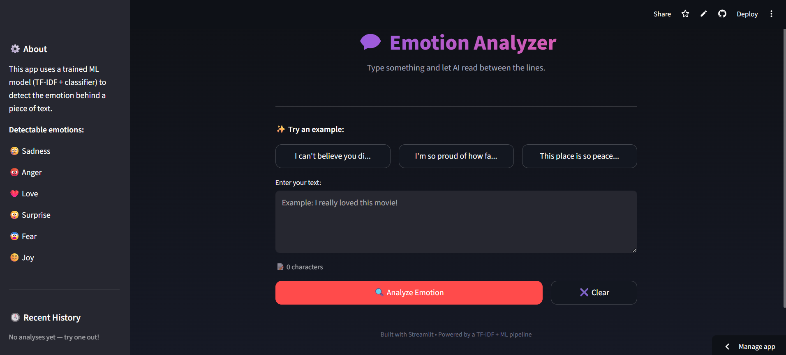
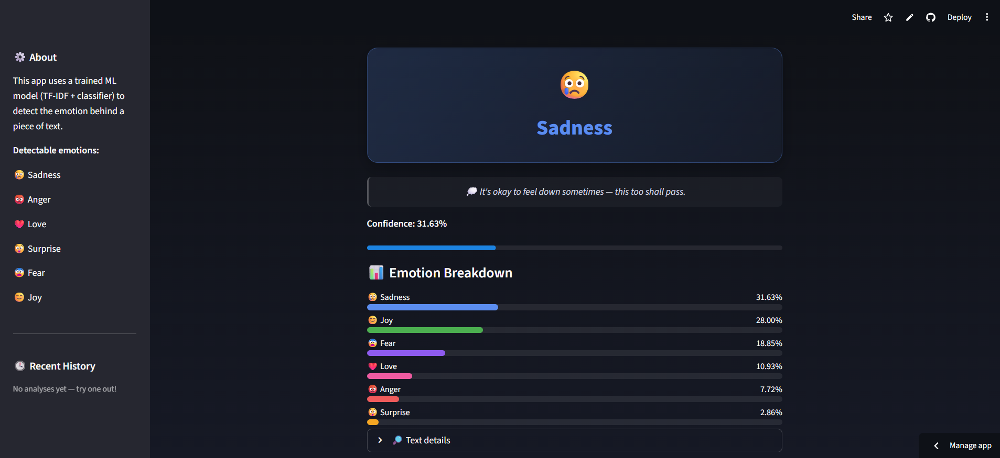
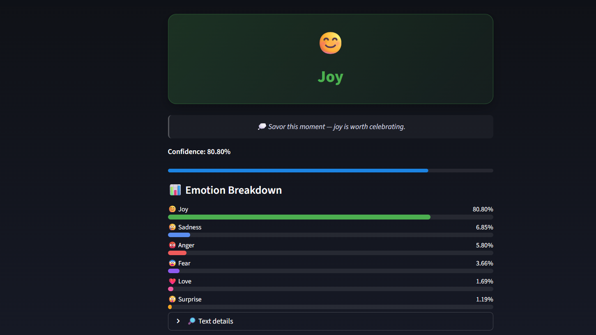
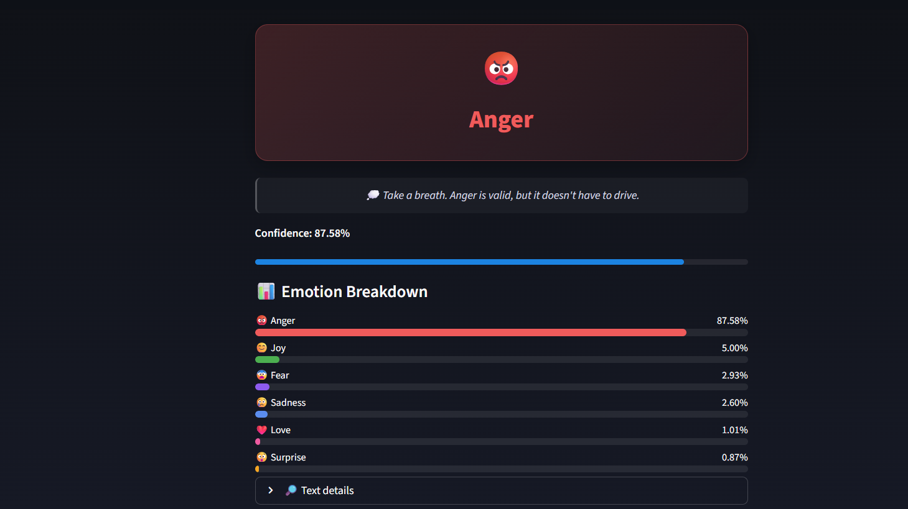

# 🎭 Sentiment Analysis — Machine Learning

A Machine Learning based **Sentiment Analysis system** that analyzes text and predicts the underlying emotion from the user's input.

The project uses **TF-IDF text vectorization** and **Logistic Regression** to transform natural language into meaningful numerical features and classify text into **6 different emotions**.

[Sentiment-Analysis-Live-Project](https://sentiment-analysis-princebuildsai.streamlit.app/)
---

## 📸 Project Preview

<table align="center">
  <tr>
    <td style="border: 2px solid #00aaff; border-radius: 12px; padding: 6px; box-shadow: 0 0 15px #00aaff;">
      
    </td>
    <td style="border: 2px solid #00aaff; border-radius: 12px; padding: 6px; box-shadow: 0 0 15px #00aaff;">
      
    </td>
  </tr>

  <tr>
    <td style="border: 2px solid #00aaff; border-radius: 12px; padding: 6px; box-shadow: 0 0 15px #00aaff;">
      
    </td>
    <td style="border: 2px solid #00aaff; border-radius: 12px; padding: 6px; box-shadow: 0 0 15px #00aaff;">
      
    </td>
  </tr>
</table>

---

## ✨ Project Highlights

| Feature            | Details                     |
| ------------------ | --------------------------- |
| 🎯 Prediction Task | Text Emotion Classification |
| 🤖 ML Model        | Logistic Regression         |
| 📝 Text Processing | TF-IDF Vectorization        |
| 🎭 Emotion Classes | **6**                       |
| 🟢 Emotion         | Joy                         |
| 🔴 Emotion         | Anger                       |
| 🔵 Emotion         | Sadness                     |
| 💗 Emotion         | Love                        |
| 🟣 Emotion         | Surprise                    |
| 🟠 Emotion         | Fear                        |
| 🌐 Deployment      | Streamlit                   |
| 💾 Model Format    | Joblib                      |

---

## 🧠 Emotions Predicted

The model classifies text into **6 emotional categories**:

* 😊 **Joy**
* 😢 **Sadness**
* 😡 **Anger**
* ❤️ **Love**
* 😲 **Surprise**
* 😨 **Fear**

This allows the system to understand more than just positive or negative sentiment and identify the **specific emotional tone** of the input.

---

## ⚙️ Machine Learning Pipeline

```text
User Text
    ↓
Text Cleaning
    ↓
TF-IDF Vectorization
    ↓
Feature Extraction
    ↓
Logistic Regression
    ↓
Emotion Prediction
    ↓
Prediction Confidence
```

---

## 🤖 Machine Learning Approach

### 1️⃣ Text Preprocessing

The input text is cleaned and prepared before being passed to the machine learning model.

Common preprocessing operations include:

* Removing unnecessary characters
* Cleaning text
* Normalizing input
* Preparing text for vectorization

### 2️⃣ TF-IDF Vectorization

**TF-IDF (Term Frequency–Inverse Document Frequency)** converts text into numerical features that can be understood by the ML model.

It helps the model identify words that are important within the text while reducing the influence of very common words.

### 3️⃣ Logistic Regression

The processed TF-IDF features are passed to a **Logistic Regression classifier**.

The trained model predicts one of the **6 emotion classes**.

---

## 📊 Model Architecture

```text
Raw Text
   │
   ▼
Text Preprocessing
   │
   ▼
TF-IDF Vectorizer
   │
   ▼
Numerical Features
   │
   ▼
Logistic Regression
   │
   ▼
6 Emotion Classes
   │
   ▼
Prediction + Confidence
```

---

## 🛠️ Tech Stack

### Programming

* 🐍 Python

### Data & Machine Learning

* 🐼 Pandas
* 🔢 NumPy
* 🤖 Scikit-learn
* 💾 Joblib

### NLP

* 📝 TF-IDF Vectorizer
* 🔤 Text Preprocessing
* 🎭 Emotion Classification

### Deployment

* 🌐 Streamlit

---

## 🚀 Key Features

### 🔹 Real-Time Prediction

Enter any text and receive an instant emotion prediction.

### 🔹 Multi-Class Emotion Detection

Instead of limiting predictions to positive/negative, the model identifies **6 different emotions**.

### 🔹 Prediction Confidence

The application can display the model's confidence for the predicted emotion.

### 🔹 Interactive Web Interface

The trained ML model is integrated into a simple and user-friendly **Streamlit application**.

### 🔹 Saved ML Pipeline

The trained model and TF-IDF vectorizer are stored using **Joblib**, allowing the application to load the trained components without retraining.

---

## 💡 Example

**Input:**

```text
I am extremely happy today!
```

**Prediction:**

```text
😊 Joy
```

Another example:

```text
I am really angry about what happened.
```

**Prediction:**

```text
😡 Anger
```

---

## 🔄 How It Works

1. 👤 User enters a sentence.
2. 🧹 The text is cleaned and processed.
3. 📝 TF-IDF converts the text into numerical features.
4. 🤖 Logistic Regression analyzes the extracted features.
5. 🎭 The model predicts the emotion.
6. 📊 The application displays the prediction and confidence.

---

## 🌐 Run Locally

### 1️⃣ Clone the Repository

```bash
git clone https://github.com/PrinceBuildsAI/sentiment-analysis.git
```

### 2️⃣ Move Into the Project

```bash
cd sentiment-analysis
```

### 3️⃣ Install Dependencies

```bash
pip install -r requirements.txt
```

### 4️⃣ Run Streamlit

```bash
streamlit run app.py
```

The application will open in your browser.

---

## 📌 Project Impact

This project demonstrates how **Natural Language Processing and Machine Learning** can be combined to automatically understand emotions expressed through text.

It provides practical experience with the complete ML workflow:

**Data → Preprocessing → Feature Engineering → Model Training → Evaluation → Prediction → Deployment**

---

## 🔮 Future Improvements

* 🧠 Experiment with advanced NLP models such as BERT
* 📈 Improve classification performance
* 🌍 Add multilingual sentiment analysis
* 📊 Add emotion probability visualizations
* 💬 Support larger text inputs
* ⚡ Optimize inference speed
* 🚀 Deploy an advanced transformer-based version

---

## 🎯 Skills Demonstrated

**Python • NLP • Machine Learning • Text Preprocessing • Feature Engineering • TF-IDF • Logistic Regression • Model Evaluation • Joblib • Streamlit • ML Deployment**

---

## 👨‍💻 Author

**PrinceBuildsAI**

Built as a practical Machine Learning and NLP project to explore how AI can understand human emotions through text.

---

⭐ **If you found this project interesting, consider giving the repository a star!**
